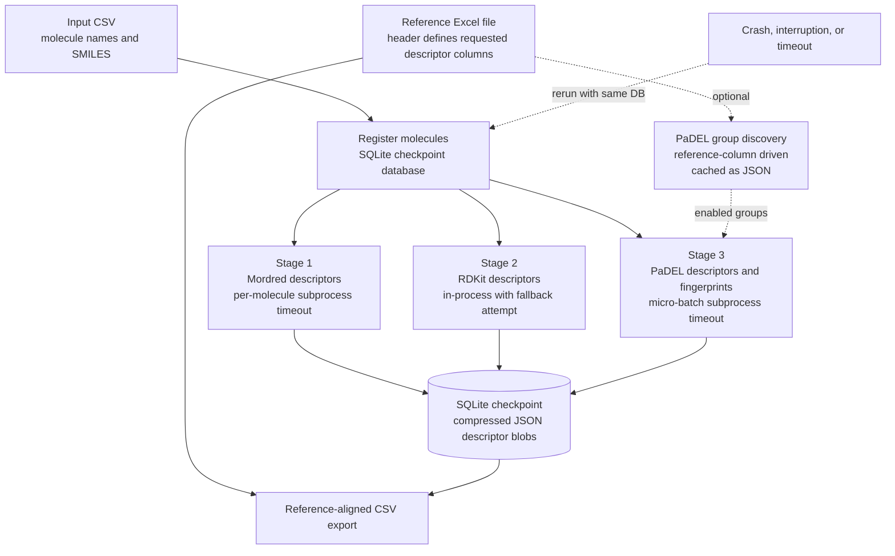
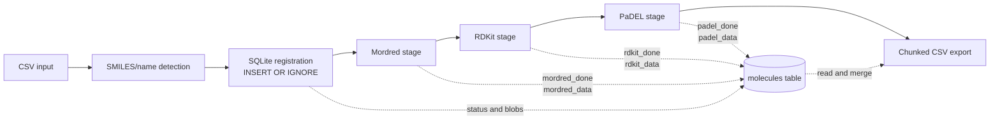
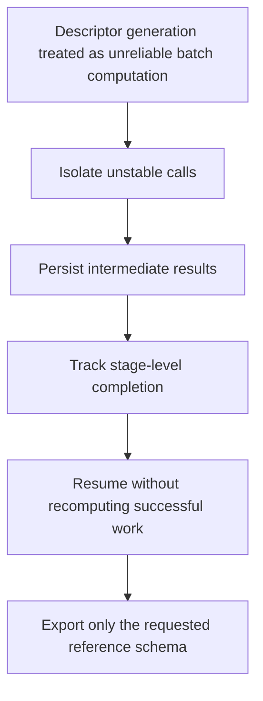

# Robust Molecular Descriptor Checkpoint Pipeline

[](https://www.python.org/)
[](https://www.rdkit.org/)
[](https://github.com/mordred-descriptor/mordred)
[](https://github.com/ecrl/padelpy)
[](https://www.sqlite.org/)
[](#quick-start)
[](#limitations)

A fault-tolerant, restartable molecular descriptor-generation workflow for SMILES tables, implemented as a standalone Python script.

The repository currently centers on `robust_descriptor_pipeline_1.py`, which computes descriptors from three cheminformatics backends — **Mordred**, **RDKit**, and **PaDEL** — while saving intermediate results to a SQLite checkpoint database. The final export is a CSV descriptor matrix aligned to descriptor-column names read from a user-provided Excel reference file.

This README is written conservatively from the provided source code. It distinguishes implemented behavior from workflow intent and recommended future additions.

---

## Why this repository exists

Descriptor generation for large molecular collections can be operationally fragile. Individual SMILES may fail to parse, descriptor libraries may return non-numeric values, Java-backed PaDEL execution may fail, and long-running calculations can be interrupted.

`robust_descriptor_pipeline_1.py` addresses this practical issue by treating descriptor generation as a checkpointed batch-computing task:

- molecules are registered once in a SQLite database;
- each descriptor backend has its own completion flag;
- successful descriptor dictionaries are written incrementally;
- selected calculations are isolated in spawned subprocesses with hard timeouts;
- PaDEL is executed in micro-batches with individual fallback attempts;
- final export streams rows from SQLite rather than loading all descriptors into memory at once.

The implementation is suitable as a research utility for generating descriptor tables, especially when a target descriptor schema already exists and must be matched during export.

---

## Graphical abstract



---

## Repository scope

This repository currently contains one implemented workflow script rather than a packaged Python library.

| File or artifact | Role | Status |
| --- | --- | --- |
| `robust_descriptor_pipeline_1.py` | Standalone descriptor pipeline with CLI and Spyder-style execution block | Implemented |
| `descriptor_checkpoint.db` | SQLite checkpoint database created by the script | Runtime output |
| `descriptor_checkpoint.db-wal`, `descriptor_checkpoint.db-shm` | SQLite WAL-mode companion files that may appear while the database is active | Runtime output |
| `descriptor_pipeline.log` | Log file written by `setup_logging()` | Runtime output |
| `<checkpoint_db>.padel_groups.json` | Cache of reference-derived PaDEL descriptor groups when `--padel-restrict-to-ref` is used | Optional runtime output |
| final descriptor CSV | Reference-aligned descriptor matrix exported by `export_chunked_csv()` | Runtime output |

No automated tests, package metadata, pinned environment file, example dataset, or citation metadata were present in the provided file.

---

## Implemented script

### `robust_descriptor_pipeline_1.py`

`robust_descriptor_pipeline_1.py` implements the full workflow in a single file:

1. configure logging;
2. create or reopen a SQLite checkpoint database;
3. register molecules from an input CSV;
4. run Mordred descriptors unless skipped;
5. run RDKit descriptors unless skipped;
6. run PaDEL descriptors and fingerprints unless skipped;
7. export a reference-aligned CSV.

The script can be executed from the command line or from the hardcoded Spyder block at the bottom of the file.

---

## Code-to-README validation note

The following statements are directly supported by the inspected code:

- SQLite checkpointing is implemented through the `CheckpointDB` class.
- The database uses WAL journal mode and `synchronous=NORMAL`.
- Molecules are stored in a `molecules` table with stage flags for Mordred, RDKit, and PaDEL.
- Descriptor dictionaries are serialized as JSON and compressed with `zlib`.
- Mordred and PaDEL stages are executed through a custom spawned subprocess timeout wrapper.
- RDKit is computed in-process first, with a subprocess fallback only if an exception escapes the first call.
- Final export is streamed from SQLite in chunks of 5,000 rows by default.
- Exported CSV columns are `Name` followed by descriptor columns read from the reference Excel header, excluding exactly `Name` and `smile`.
- Missing descriptors, non-finite numeric values, and some non-numeric descriptor values are converted or exported as `0.0`.
- Optional PaDEL group restriction is implemented through reference-column matching and empirical probing of PaDEL 2D groups.
- The CLI exposes `--qm9`, `--ref`, `--out`, `--db`, `--max`, timeout settings, PaDEL batch size, stage-skip flags, and `--padel-restrict-to-ref`.

The following are not guaranteed by the current code alone:

- exact descriptor counts across environments;
- exact runtime, speedup, or memory use;
- bitwise reproducibility across platforms;
- chemical validity of every descriptor for every input molecule;
- automatic retry of molecules already marked failed;
- automatic periodic partial export during the main pipeline.

---

## Workflow overview



The stages are orchestrated sequentially by `run_pipeline(...)`. They are not separate command-line programs, although each stage is implemented as a separate Python function and can be skipped with CLI flags.

---

## Input requirements

### Molecule CSV

The input molecule table is read using `pandas.read_csv`.

The script first attempts UTF-8 encoding, then falls back to Latin-1, and then CP1252 if decoding fails.

#### SMILES column detection

The script searches for a SMILES column in this exact order:

```text
smiles
SMILES
Smiles
canonical_smiles
smi
```

If none of these columns exist, the first column in the CSV is used as the SMILES column.

#### Molecule identifier detection

The script searches for a molecule-name column in this exact order:

```text
name
Name
mol_id
id
gdb_idx
```

If no identifier column is present, generated identifiers are used:

```text
qm9_000000
qm9_000001
qm9_000002
...
```

#### Important name/SMILES alignment detail

The code independently drops missing values from the SMILES column and, when present, the name column. It then truncates both lists to the same minimum length. If missing values occur in only one of these columns, row-level alignment may be lost. Provide input files with complete, row-aligned names and SMILES.

---

### Reference Excel file

The reference file is read using:

```python
pd.read_excel(reference_xlsx, nrows=0)
```

Only the header is used. The exported descriptor schema is derived from all reference columns except exactly:

```text
Name
smile
```

The final CSV always contains:

```text
Name,<reference descriptor columns...>
```

Column filtering is case-sensitive. For example, `SMILES`, `Smiles`, or `smiles` in the reference file are not excluded by the current code unless they are also descriptor names intentionally requested by the user.

---

## Checkpoint database design

The SQLite table is created with the following conceptual schema:

| Column | Purpose |
| --- | --- |
| `name` | Primary key molecule identifier |
| `smiles` | SMILES string |
| `mordred_done` | Mordred status flag |
| `rdkit_done` | RDKit status flag |
| `padel_done` | PaDEL status flag |
| `mordred_data` | Compressed JSON blob of Mordred descriptors |
| `rdkit_data` | Compressed JSON blob of RDKit descriptors |
| `padel_data` | Compressed JSON blob of PaDEL descriptors |
| `error_log` | Appended text log for failed stages |
| `created_at` | Registration timestamp |
| `updated_at` | Last update timestamp |

Stage status flags use:

| Value | Meaning |
| --- | --- |
| `0` | Pending |
| `1` | Successfully completed |
| `-1` | Failed |

### Restart behavior

On rerun with the same checkpoint database:

- rows already present are not reinserted because registration uses `INSERT OR IGNORE`;
- molecules with stage flag `1` are skipped for that stage;
- molecules with stage flag `-1` are also skipped, because pending queries select only rows where the flag equals `0`.

This means failed molecules are not automatically retried on a normal rerun. Retrying failed molecules requires manual database intervention, a new checkpoint database, or code modification.

---

## Descriptor stages

### Stage 1: Mordred

Implemented by:

```text
_compute_mordred_single()
run_mordred_stage()
```

Confirmed behavior:

- converts each SMILES with `rdkit.Chem.MolFromSmiles`;
- constructs `mordred.Calculator(descriptors, ignore_3D=True)`;
- computes Mordred descriptors for one molecule at a time;
- executes each molecule in a spawned subprocess through `TimeoutExecutor`;
- stores finite numeric descriptor values as floats;
- converts non-finite numeric values to `0.0`;
- converts non-numeric descriptor outputs to `0.0`;
- marks the stage failed for a molecule if the subprocess returns `None`, returns an empty dictionary, or times out.

The default CLI timeout is 120 seconds per molecule.

---

### Stage 2: RDKit

Implemented by:

```text
_compute_rdkit_single()
run_rdkit_stage()
```

Confirmed behavior:

- converts each SMILES with `rdkit.Chem.MolFromSmiles`;
- uses descriptor names from `rdkit.Chem.Descriptors._descList`;
- computes descriptors with `rdkit.ML.Descriptors.MoleculeDescriptors.MolecularDescriptorCalculator`;
- computes `qed` with `rdkit.Chem.QED.qed`;
- stores finite numeric values as floats;
- converts invalid, non-finite, or non-numeric values to `0.0`;
- renames RDKit `TPSA` to `TPSA_y`;
- marks the molecule failed if no descriptor dictionary is produced.

The RDKit stage is primarily in-process. The subprocess timeout fallback is only reached if `_compute_rdkit_single()` raises an exception to the caller. Because `_compute_rdkit_single()` catches exceptions internally and returns `None`, many RDKit failures will be recorded as computation errors rather than retried through the fallback.

---

### Stage 3: PaDEL

Implemented by:

```text
_build_padel_descriptor_xml()
_compute_padel_batch()
_compute_padel_single_fallback()
run_padel_stage()
```

Confirmed behavior:

- processes molecules in micro-batches;
- writes valid RDKit-parsed molecules to temporary SDF files;
- calls `padelpy.padeldescriptor`;
- enables `fingerprints=True` and `d_2d=True`;
- uses `detectaromaticity=True`;
- uses `standardizenitro=True`;
- uses `standardizetautomers=True`;
- uses `removesalt=True`;
- uses `threads=2` for batch PaDEL calls and `threads=1` for single-molecule fallback;
- wraps each batch in a spawned subprocess timeout;
- retries molecules individually when a batch fails or when an individual molecule is absent from a returned batch result;
- renames PaDEL `nH`, `nC`, and `nN` to `nH_y`, `nC_y`, and `nN_y`;
- stores successfully parsed PaDEL outputs as floats, converting non-numeric values to `0.0`.

The batch-level timeout used by the wrapper is:

```text
padel_timeout * batch_size + 60 seconds
```

The individual fallback wrapper timeout is:

```text
padel_timeout + 30 seconds
```

The code also passes a `maxruntime` argument into `padelpy.padeldescriptor`. Its exact interpretation is delegated to PaDEL/padelpy and should not be treated as the same mechanism as the outer Python subprocess timeout.

---

## PaDEL descriptor XML behavior

### Default PaDEL configuration

When no reference-driven restriction is supplied, `_build_padel_descriptor_xml(enabled_groups=None)` starts from padelpy's bundled `descriptors.xml`, preserves the XML defaults, and additionally enables these five fingerprint groups if they are present in the XML:

```text
Fingerprinter
ExtendedFingerprinter
GraphOnlyFingerprinter
AtomPairs2DFingerprinter
AtomPairs2DFingerprintCount
```

This does not necessarily mean every PaDEL descriptor group is forced on. It means the bundled defaults are kept and the five listed fingerprint groups are changed from `false` to `true` where matching XML entries exist.

### Reference-driven PaDEL restriction

When `--padel-restrict-to-ref` is used, the script calls:

```text
discover_required_padel_groups()
```

This function:

1. checks for a cached JSON group list at `<checkpoint_db>.padel_groups.json`;
2. maps fingerprint-like reference column names to PaDEL fingerprint groups using regular expressions;
3. probes each known PaDEL 2D descriptor group on a small probe molecule;
4. adds a group if its produced columns overlap the reference descriptor columns;
5. writes the discovered group list to the cache path when possible;
6. passes only those groups into the PaDEL XML writer.

This is a practical reference-column selection mechanism. It is not a chemical validation procedure and does not prove that every missing reference descriptor is impossible to compute.

---

## Descriptor-name harmonization

The code performs a small number of explicit renames to match an expected external descriptor convention:

| Backend | Original key | Exported key |
| --- | --- | --- |
| RDKit | `TPSA` | `TPSA_y` |
| PaDEL | `nH` | `nH_y` |
| PaDEL | `nC` | `nC_y` |
| PaDEL | `nN` | `nN_y` |

No other systematic namespace prefixing is implemented. When multiple descriptor backends produce the same key, the merge order during export is:

```text
Mordred data -> RDKit data -> PaDEL data
```

Later dictionaries overwrite earlier keys with the same descriptor name.

---

## Outputs

| Output | Produced by | Description |
| --- | --- | --- |
| `descriptor_checkpoint.db` or user-specified `--db` | `CheckpointDB` | SQLite checkpoint database |
| `descriptor_checkpoint.db-wal`, `descriptor_checkpoint.db-shm` | SQLite WAL mode | Temporary or persistent companion files depending on SQLite state |
| `descriptor_pipeline.log` | `setup_logging()` | Log file opened in append mode |
| `<checkpoint_db>.padel_groups.json` | `discover_required_padel_groups()` | Optional PaDEL group cache when `--padel-restrict-to-ref` is enabled |
| output CSV | `export_chunked_csv()` | Final descriptor table with `Name` plus reference-derived descriptor columns |
| temporary SDF, CSV, XML, and pickle files | PaDEL and timeout helpers | Intermediate files that the code attempts to delete |

---

## Output semantics

During export, for each molecule:

1. the script decompresses and loads available Mordred, RDKit, and PaDEL descriptor blobs;
2. descriptor dictionaries are merged;
3. only columns requested by the reference Excel file are written;
4. missing requested descriptors are written as `0.0`;
5. values that fail conversion to float are written as `0.0`;
6. the final row begins with the molecule `Name`.

Because missing descriptors are zero-filled, downstream users should decide whether zero imputation is scientifically appropriate for their modeling or statistical workflow.

---

## Suggested repository layout

The current script accepts explicit paths and does not require a fixed repository layout. 
```text
.
├── README.md
├── robust_descriptor_pipeline_1.py
├── data/
│   ├── input/
│   │   ├── molecules.csv
│   │   └── reference_descriptors.xlsx
│   └── output/
│       └── descriptors.csv
├── checkpoints/
│   └── descriptor_checkpoint.db
├── logs/
│   └── descriptor_pipeline.log
├── examples/
│   ├── small_molecules.csv
│   └── small_reference.xlsx
├── environment.yml
├── CITATION.cff
└── LICENSE
```

Files such as `environment.yml`, `CITATION.cff`, examples, tests, and a license are recommended additions. They are not implemented in the provided code.

---

## Suggested software environment

### Python packages imported by the script

Non-standard Python dependencies used by the code include:

```text
numpy
pandas
rdkit
mordred
padelpy
```

For `.xlsx` reference files, pandas commonly requires an Excel reader engine such as:

```text
openpyxl
```

### External executable dependency

PaDEL execution through `padelpy` requires a working Java runtime.

### Example Conda environment setup

```bash
conda create -n descriptor-pipeline python=3.10 -y
conda activate descriptor-pipeline

conda install -c conda-forge rdkit numpy pandas openpyxl -y
pip install mordred padelpy
```

Verify Java separately:

```bash
java -version
```

This is a suggested environment, not a pinned reproducibility specification.

---

## Quick start

### Command-line execution

```bash
python robust_descriptor_pipeline_1.py \
  --qm9 data/input/molecules.csv \
  --ref data/input/reference_descriptors.xlsx \
  --out data/output/descriptors.csv \
  --db checkpoints/descriptor_checkpoint.db
```

### Small test run

```bash
python robust_descriptor_pipeline_1.py \
  --qm9 data/input/molecules.csv \
  --ref data/input/reference_descriptors.xlsx \
  --out data/output/descriptors_test.csv \
  --db checkpoints/descriptor_checkpoint_test.db \
  --max 100
```

### Skip one or more descriptor backends

```bash
python robust_descriptor_pipeline_1.py \
  --qm9 data/input/molecules.csv \
  --ref data/input/reference_descriptors.xlsx \
  --out data/output/descriptors_no_padel.csv \
  --db checkpoints/descriptor_checkpoint_no_padel.db \
  --skip-padel
```

### Use reference-driven PaDEL group restriction

```bash
python robust_descriptor_pipeline_1.py \
  --qm9 data/input/molecules.csv \
  --ref data/input/reference_descriptors.xlsx \
  --out data/output/descriptors.csv \
  --db checkpoints/descriptor_checkpoint.db \
  --padel-restrict-to-ref
```

### Lower PaDEL batch size

```bash
python robust_descriptor_pipeline_1.py \
  --qm9 data/input/molecules.csv \
  --ref data/input/reference_descriptors.xlsx \
  --out data/output/descriptors.csv \
  --db checkpoints/descriptor_checkpoint.db \
  --padel-batch 5
```

A smaller PaDEL batch size may reduce the impact of batch-level PaDEL failures, although runtime and robustness depend on the molecules and environment.

---

## Command-line reference

| Argument | Default | Required | Description |
| --- | ---: | :---: | --- |
| `--qm9` | none | yes | Input molecule CSV |
| `--ref` | none | yes | Reference Excel file used to define output descriptor columns |
| `--out` | `qm9_descriptors.csv` | no | Output CSV |
| `--db` | `descriptor_checkpoint.db` | no | SQLite checkpoint database |
| `--max` | `None` | no | Maximum number of molecules to process |
| `--padel-batch` | `25` | no | Number of molecules per PaDEL batch |
| `--mordred-timeout` | `120` | no | Outer subprocess timeout for each Mordred molecule, in seconds |
| `--rdkit-timeout` | `60` | no | Timeout for the RDKit subprocess fallback path, in seconds |
| `--padel-timeout` | `45` | no | Per-molecule value used to construct PaDEL wrapper timeouts |
| `--skip-mordred` | `False` | no | Skip Mordred stage |
| `--skip-rdkit` | `False` | no | Skip RDKit stage |
| `--skip-padel` | `False` | no | Skip PaDEL stage |
| `--padel-restrict-to-ref` | `False` | no | Discover and enable only PaDEL groups that appear to produce requested reference columns |

---

## Spyder usage

The file includes a Spyder-oriented execution block under:

```python
if __name__ == "__main__":
```

When the script is run without CLI-style arguments beginning with `--`, it uses hardcoded Windows paths in the bottom block:

```text
C:\Users\Woon\Documents\DICC\Inverteddesign\Book4.csv
C:\Users\Woon\Documents\DICC\Inverteddesign\modified_skewness_filtered_data_updated_smile.xlsx
C:\Users\Woon\Documents\DICC\Inverteddesign\book4_descriptors.csv
C:\Users\Woon\Documents\DICC\Inverteddesign\descriptor_checkpoint.db
```

These paths are user-specific and must be edited before reuse.

The default Spyder block sets:

```text
max_molecules=100
mordred_timeout=120
rdkit_timeout=60
padel_timeout=45
padel_batch_size=25
skip_mordred=False
skip_rdkit=False
skip_padel=False
```

The Spyder block does not pass `padel_restrict_to_ref=True`; therefore, reference-driven PaDEL restriction is disabled in the default Spyder configuration.

---

## Using the workflow safely

### Recommended first run

Start with a small molecule subset:

```bash
python robust_descriptor_pipeline_1.py \
  --qm9 data/input/molecules.csv \
  --ref data/input/reference_descriptors.xlsx \
  --out data/output/smoke_test.csv \
  --db checkpoints/smoke_test.db \
  --max 10 \
  --padel-batch 2
```

Check:

- the script imports all dependencies;
- Java and PaDEL execution work;
- the output CSV has the expected columns;
- the log file contains no unexpected systematic failures.

### Production run

Use a persistent checkpoint path and keep it after completion:

```bash
python robust_descriptor_pipeline_1.py \
  --qm9 data/input/molecules.csv \
  --ref data/input/reference_descriptors.xlsx \
  --out data/output/descriptors.csv \
  --db checkpoints/descriptor_checkpoint.db
```

### Resume after interruption

Run the same command with the same checkpoint database. Completed stage results are skipped. Failed stage results are not retried unless their status flags are reset.

---

## Reproducibility notes

For manuscript or dataset release, record:

- exact repository commit;
- exact command line;
- Python version;
- operating system;
- Java version;
- `numpy` version;
- `pandas` version;
- RDKit version;
- Mordred version;
- padelpy version;
- PaDEL version or padelpy-bundled PaDEL distribution details;
- input CSV checksum;
- reference Excel checksum;
- checkpoint database checksum, if archived;
- whether `--padel-restrict-to-ref` was used;
- PaDEL batch size and timeout values;
- number of molecules registered;
- number of successes and failures for each stage.

The current code does not create a reproducibility manifest automatically.

---

## Failure handling and interpretation

The pipeline is designed to continue after molecule-level or backend-level failures, but the semantics are important:

- invalid SMILES generally lead to missing descriptor dictionaries and failed stage flags;
- a timeout or empty result is recorded as a failed stage;
- failure messages are appended to the `error_log` field;
- failed stages are not included in descriptor merging unless a descriptor blob exists;
- missing requested output columns are filled with `0.0`;
- rerunning the script does not retry `-1` failed stages.

Consider exporting the failure table from SQLite and reporting stage-level failure counts.

Example SQLite query:

```sql
SELECT name, mordred_done, rdkit_done, padel_done, error_log
FROM molecules
WHERE mordred_done = -1
   OR rdkit_done = -1
   OR padel_done = -1;
```

---

## Methodological contribution

The code does not implement a new molecular descriptor theory. Its contribution is an operational pattern for robust descriptor production:



This makes the workflow useful for producing descriptor matrices under realistic failure conditions, while preserving a transparent checkpoint trail.

---

## The repository


| Addition | Purpose |
| --- | --- |
| `environment.yml` or `requirements.txt` | Pin dependencies for reproducibility |
| `CITATION.cff` | Enable GitHub citation metadata |
| `LICENSE` | Clarify reuse terms |
| small example CSV and Excel reference | Provide a runnable smoke test |
| expected output for the example | Enable regression checks |
| automated test for `--max 2` or `--max 5` | Catch dependency and CLI breakage |
| failure-report export utility | Make failed molecules easier to inspect |
| run manifest writer | Record package versions, hashes, arguments, and timestamps |
| schema/version field in SQLite | Support future checkpoint migrations |
| documented policy for zero-filled missing descriptors | Clarify downstream interpretation |
| optional retry command for failed rows | Avoid manual SQLite edits |
| CI workflow | Validate imports and basic execution |

These are recommendations, not current functionality.

---

## Limitations

- The repository currently provides a standalone script, not an installable package.
- No pinned dependency file was provided.
- No automated test suite was provided.
- Exact descriptor availability depends on installed package versions and PaDEL behavior.
- Failed rows are not automatically retried on rerun.
- The `export_interval` parameter and `export_partial()` helper exist in the code, but periodic partial export is not called inside `run_pipeline()`.
- The reference Excel filter excludes only exact column names `Name` and `smile`.
- Missing descriptors are exported as `0.0`, which may be inappropriate for some downstream analyses.
- Descriptor-name collisions are only partly addressed through selected renames.
- The input name and SMILES columns are separately `dropna()`-filtered, which may misalign rows if missingness differs between columns.
- PaDEL depends on Java and external/runtime behavior outside Python's direct control.
- The optional PaDEL group-discovery step is heuristic and reference-driven.
- The script does not automatically write an error-report CSV.
- The script does not create output directories automatically before opening the output CSV or log file.

---

## Example citation block

Replace the placeholder fields with the actual repository metadata before publication:

```bibtex
@software{robust_descriptor_checkpoint_pipeline,
  title        = {Robust Molecular Descriptor Checkpoint Pipeline},
  author       = {Your Name and Contributors},
  year         = {2026},
  url          = {https://github.com/your-username/your-repository},
  note         = {Checkpointed research utility for Mordred, RDKit, and PaDEL descriptor generation}
}
```

Also cite the descriptor engines used by the workflow — RDKit, Mordred, PaDEL, and padelpy where appropriate — according to their recommended citation practices.

---

## Acknowledgments

This workflow depends on open-source scientific software from the cheminformatics and Python ecosystems, including RDKit, Mordred, PaDEL, padelpy, pandas, NumPy, and SQLite.

---


