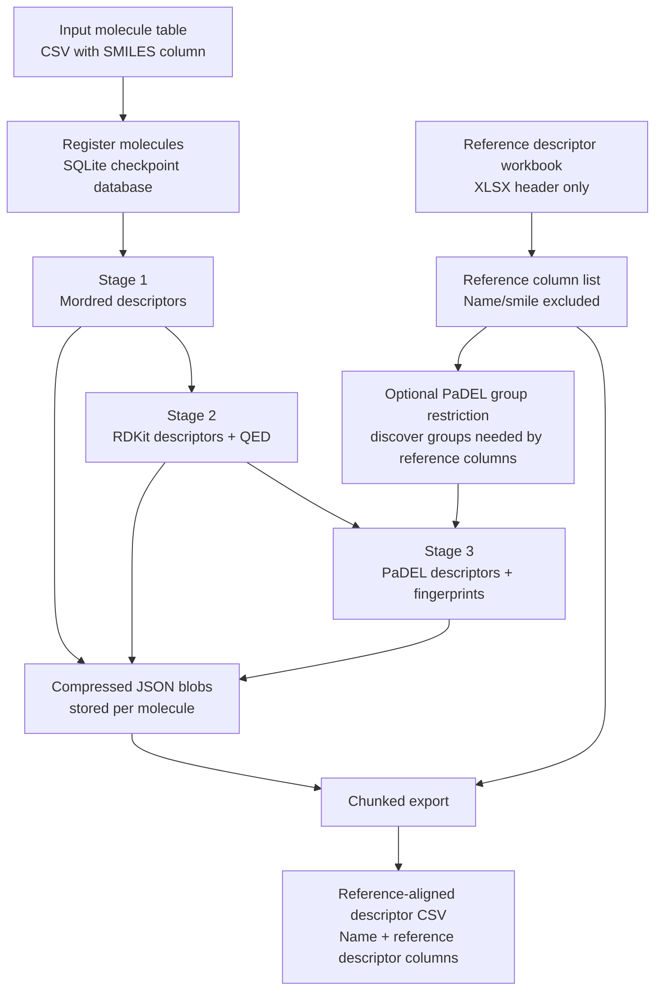
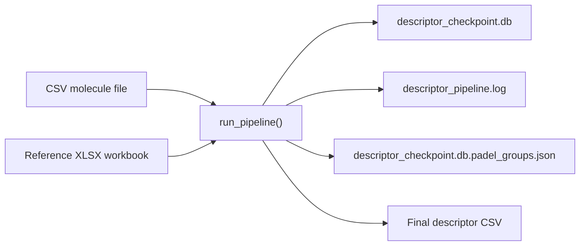
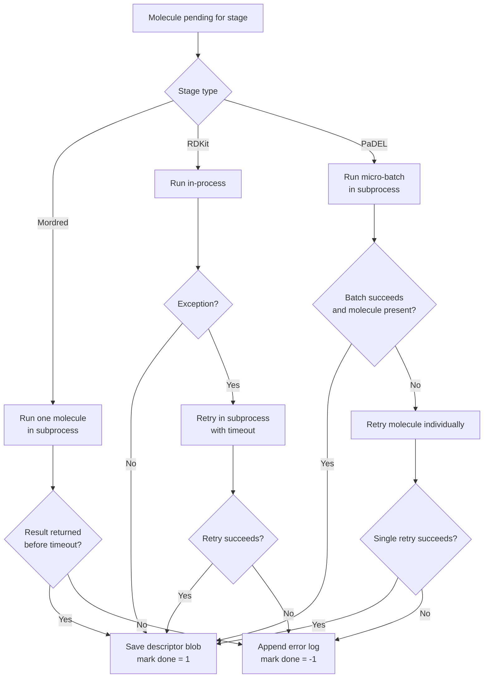
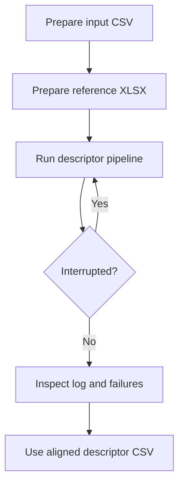

# Robust Molecular Descriptor Pipeline


A fault-tolerant, restartable molecular descriptor generation pipeline for QM9-scale descriptor computation using **Mordred**, **RDKit**, and **PaDEL-Descriptor**.

The repository centers on a single Python workflow script that computes molecular descriptors from a SMILES table, stores intermediate results in a crash-safe SQLite checkpoint database, and exports a reference-aligned descriptor matrix suitable for downstream modeling or manuscript-associated data preparation.

---

## Why this repository exists

Large-scale descriptor generation can fail for practical engineering reasons that are not always addressed by standard descriptor APIs:

- Java-based PaDEL calculations can exhaust memory or hang on difficult molecular graphs.
- Mordred can stall on specific molecular topologies.
- A long descriptor run can lose hours of work if results are only kept in memory.
- Different descriptor libraries can produce overlapping column names that must be reconciled consistently.
- Publication workflows often require descriptor outputs aligned to a fixed reference workbook.

This repository implements a conservative, restartable descriptor-generation workflow that treats descriptor calculation as a staged, checkpointed computation rather than a single fragile batch job.

---

## Graphical abstract



---

## Repository scope

This repository currently provides a **single-script descriptor pipeline**, not a packaged Python library.

Implemented in the provided script:

| Component | Implemented? | Notes |
|---|---:|---|
| SQLite checkpoint database | Yes | Uses WAL mode and compressed JSON descriptor blobs. |
| Mordred stage | Yes | Per-molecule subprocess execution with hard timeout. |
| RDKit stage | Yes | In-process calculation with exception fallback to subprocess. |
| PaDEL stage | Yes | Micro-batch SDF workflow with subprocess timeout and single-molecule fallback. |
| Reference-column alignment | Yes | Output CSV is aligned to columns from an XLSX reference header. |
| CLI entry point | Yes | Uses `argparse` when command-line flags are supplied. |
| Spyder/manual path mode | Yes | Hardcoded Windows paths are present in the `__main__` block for interactive use. |
| Full test suite | Not included | The script comments mention validation artifacts, but they are not part of the provided file set. |
| Package installation metadata | Not included | No `pyproject.toml`, `environment.yml`, or `requirements.txt` is currently provided. |

---

## Main script

The workflow is implemented in:

```text
robust_descriptor_pipeline.py
```

The uploaded file was named `robust_descriptor_pipeline_1.py`; for a publication repository, renaming it to `robust_descriptor_pipeline.py` is recommended for consistency with the script header and command examples.

---

## What the script does

The script performs four major tasks:

1. **Registers molecules**
   - Reads a CSV file containing SMILES.
   - Detects a SMILES column from common names such as `smiles`, `SMILES`, `Smiles`, `canonical_smiles`, or `smi`.
   - Detects a molecule-name column from common names such as `name`, `Name`, `mol_id`, `id`, or `gdb_idx`.
   - If no name column is found, generates names such as `qm9_000000`.

2. **Computes descriptors in stages**
   - Mordred descriptors are computed per molecule with a subprocess timeout.
   - RDKit descriptors are computed in-process, with fallback to a subprocess if an exception occurs.
   - PaDEL descriptors are computed in micro-batches using temporary SDF files.

3. **Stores intermediate results**
   - Each molecule has one row in a SQLite database.
   - Each descriptor family has a status flag:
     - `0` = pending
     - `1` = completed
     - `-1` = failed
   - Descriptor dictionaries are serialized as compressed JSON blobs.

4. **Exports a descriptor matrix**
   - The final CSV contains `Name` plus descriptor columns from the reference XLSX file.
   - Missing descriptors are filled with `0.0`.
   - Export is chunked to avoid loading the full descriptor table into memory.

---

## Component summary

| Code component | Purpose |
|---|---|
| `CheckpointDB` | SQLite checkpoint manager for molecule registration, result storage, failure logging, progress summaries, and chunked export. |
| `TimeoutExecutor` | Runs selected descriptor functions in a separate process with hard termination on timeout. |
| `ProgressTracker` | Reports stage progress, throughput, and estimated time remaining. |
| `_compute_mordred_single()` | Computes 2D Mordred descriptors for one SMILES string using `ignore_3D=True`. |
| `_compute_rdkit_single()` | Computes RDKit descriptor list values and QED for one SMILES string. |
| `_compute_padel_batch()` | Writes a temporary SDF micro-batch and runs PaDEL through `padelpy.padeldescriptor`. |
| `_compute_padel_single_fallback()` | Retries PaDEL for one molecule if a batch fails or omits that molecule. |
| `discover_required_padel_groups()` | Infers a restricted PaDEL descriptor-group set from reference columns. |
| `run_mordred_stage()` | Executes the Mordred stage for pending molecules. |
| `run_rdkit_stage()` | Executes the RDKit stage for pending molecules. |
| `run_padel_stage()` | Executes the PaDEL stage in micro-batches with fallback. |
| `export_results()` | Streams the SQLite checkpoint contents into a reference-aligned CSV. |
| `run_pipeline()` | Master workflow connecting input loading, checkpointing, staged computation, and export. |

---

## Combined workflow concept

The script contains a real master function, `run_pipeline()`, that orchestrates registration, descriptor generation, checkpointing, and final export.

The workflow is still intentionally file-based:



There is no separate workflow manager such as Snakemake, Nextflow, Airflow, or CWL. Restart behavior is handled internally through the SQLite checkpoint database.

---

## Highlights

- **Restartable execution**: completed molecules are skipped on rerun.
- **Stage-wise checkpointing**: Mordred, RDKit, and PaDEL completion are tracked separately.
- **Crash-tolerant storage**: SQLite WAL mode is used for the checkpoint database.
- **Compressed descriptor storage**: descriptor dictionaries are stored as zlib-compressed JSON blobs.
- **PaDEL micro-batching**: PaDEL is run on small SDF batches rather than one large job.
- **Single-molecule PaDEL fallback**: failed or missing batch results are retried individually.
- **Reference-aligned export**: output columns are matched to a reference XLSX descriptor header.
- **Version warnings**: reproducibility-critical package versions are checked and logged, but not enforced.

---

## Code-to-README validation note

This README is derived from the provided Python script and describes behavior implemented in that file. It distinguishes between:

- implemented code paths,
- reasonable workflow interpretation,
- and recommended future additions for publication readiness.

It does **not** claim the presence of tests, packaged installation metadata, containerization, continuous integration, or manuscript data files unless those are added to the repository.

---

## Detailed workflow

### 1. Input loading

The master pipeline expects:

```text
qm9_csv        CSV file containing SMILES
reference_xlsx XLSX workbook whose header defines output descriptor columns
output_csv     destination CSV file
checkpoint_db  SQLite database path
```

The CSV reader attempts encodings in this order:

1. UTF-8
2. Latin-1
3. CP1252

The reference workbook is read only for its header:

```python
ref_df = pd.read_excel(reference_xlsx, nrows=0)
```

Columns named `Name` and `smile` are excluded from the descriptor column list.

---

### 2. Checkpoint database

The checkpoint database table contains:

| Field | Meaning |
|---|---|
| `name` | Molecule identifier and primary key. |
| `smiles` | Input SMILES string. |
| `mordred_done` | Mordred status flag. |
| `rdkit_done` | RDKit status flag. |
| `padel_done` | PaDEL status flag. |
| `mordred_data` | Compressed JSON Mordred descriptor dictionary. |
| `rdkit_data` | Compressed JSON RDKit descriptor dictionary. |
| `padel_data` | Compressed JSON PaDEL descriptor dictionary. |
| `error_log` | Appended error messages for failed stages. |
| `created_at` | Registration timestamp. |
| `updated_at` | Last update timestamp. |

The database uses:

```sql
PRAGMA journal_mode=WAL
PRAGMA synchronous=NORMAL
```

This improves restart safety, but users should still retain the checkpoint database until final outputs have been inspected.

---

### 3. Mordred stage

The Mordred stage:

- processes pending molecules where `mordred_done = 0`;
- runs each molecule in a separate subprocess;
- applies a hard timeout;
- uses `Calculator(descriptors, ignore_3D=True)`;
- converts finite numeric values to floats;
- replaces non-numeric, non-finite, or failed values with `0.0`;
- commits each molecule immediately after calculation.

Failure behavior:

```text
timeout or invalid molecule -> mordred_done = -1
```

Default timeout:

```text
120 seconds per molecule
```

---

### 4. RDKit stage

The RDKit stage:

- processes pending molecules where `rdkit_done = 0`;
- computes descriptors from `rdkit.Chem.Descriptors._descList`;
- adds `qed`;
- renames `TPSA` to `TPSA_y`;
- stores finite numeric values as floats;
- replaces invalid values with `0.0`.

The first attempt is in-process. If an exception occurs, the script retries through the subprocess timeout executor.

Important nuance: the RDKit timeout only applies to the fallback subprocess path. The normal in-process RDKit path is not wrapped in a hard timeout.

Default timeout for fallback:

```text
60 seconds per molecule
```

---

### 5. PaDEL stage

The PaDEL stage:

- processes pending molecules where `padel_done = 0`;
- writes temporary SDF batches;
- converts molecules to explicit-hydrogen structures with `Chem.AddHs`;
- runs `padelpy.padeldescriptor`;
- requests 2D descriptors and fingerprints;
- applies a subprocess timeout to the batch;
- retries missing or failed molecules individually.

Default settings:

```text
batch size:              25 molecules
timeout per molecule:    45 seconds
batch timeout:           timeout_per_mol * batch_size + 60 seconds
```

The PaDEL `maxruntime` argument is passed in milliseconds:

```python
max_runtime = timeout_per_mol * 1000
```

The script also renames selected PaDEL columns to avoid collisions with Mordred-style names:

| PaDEL column | Exported as |
|---|---|
| `nH` | `nH_y` |
| `nC` | `nC_y` |
| `nN` | `nN_y` |

---

## PaDEL reference-column restriction

By default, the pipeline uses:

```python
padel_restrict_to_ref=True
```

This causes the script to infer a smaller PaDEL descriptor-group set from the reference workbook columns.

The logic combines:

1. Regex matching for known PaDEL fingerprint column families.
2. Empirical probing of PaDEL 2D descriptor groups on a small molecule.
3. JSON caching of the discovered group list.

The cache file is written next to the checkpoint database:

```text
descriptor_checkpoint.db.padel_groups.json
```

This restriction is implemented to reduce expensive PaDEL descriptor calculations and avoid problematic descriptor families for heavily fused molecular graphs. It is also described in the script comments as necessary for reproducing the accompanying reference workbook used by the author.

Users can disable this behavior:

```bash
python robust_descriptor_pipeline.py \
  --qm9 qm9.csv \
  --ref reference.xlsx \
  --out qm9_descriptors.csv \
  --no-padel-restrict-to-ref
```

Disabling restriction may substantially increase runtime and may expose PaDEL/CDK timeout behavior on difficult molecules.

---

## Outputs

### Final output CSV

The primary output is:

```text
qm9_descriptors.csv
```

The output contains:

```text
Name, descriptor_1, descriptor_2, ..., descriptor_n
```

where descriptor columns are taken from the reference XLSX header.

Missing or unavailable values are exported as `0.0`.

---

### Checkpoint database

The checkpoint database is the main restart artifact:

```text
descriptor_checkpoint.db
descriptor_checkpoint.db-wal
descriptor_checkpoint.db-shm
```

The `-wal` and `-shm` files may appear while SQLite WAL mode is active.

Do not delete the checkpoint database between interrupted runs unless you intentionally want to restart from scratch.

---

### Log file

The script writes logs to:

```text
descriptor_pipeline.log
```

Console output is logged at INFO level. The file logger records DEBUG-level messages.

---

### PaDEL group cache

When reference-based PaDEL restriction is enabled, the script may write:

```text
descriptor_checkpoint.db.padel_groups.json
```

This file stores the discovered PaDEL descriptor groups and avoids re-probing on subsequent runs.

---

## Decision and failure logic



A failed stage does not stop the full pipeline. The molecule is marked failed for that stage and the workflow continues.

At export time, missing descriptor values are filled with `0.0`; therefore users should inspect the checkpoint database or log file before interpreting zero-filled descriptors as chemically meaningful values.

---

## Suggested repository layout

```text
.
├── README.md
├── robust_descriptor_pipeline.py
├── data/
│   ├── README.md
│   ├── qm9.csv                         # user-provided or externally downloaded
│   └── reference_descriptors.xlsx       # reference header workbook
├── outputs/
│   ├── qm9_descriptors.csv              # generated
│   └── descriptor_pipeline.log          # generated
├── checkpoints/
│   └── descriptor_checkpoint.db         # generated
├── env/
│   └── environment.yml                  # recommended future addition
└── tests/
    └── test_descriptor_generation_match.py  # recommended if validation artifacts are added
```

The current script does not require this exact layout. Paths are supplied by command-line arguments or edited manually in the Spyder block.

---

## Suggested software environment

The script uses the following non-standard Python dependencies:

| Dependency | Role |
|---|---|
| `numpy` | Numeric checks and value conversion. |
| `pandas` | CSV/XLSX I/O and PaDEL CSV parsing. |
| `rdkit` | Molecule parsing, SDF writing, RDKit descriptors, QED. |
| `mordred` | Mordred descriptor calculation. |
| `padelpy` | Python wrapper for PaDEL-Descriptor. |
| `openpyxl` | Recommended Excel engine for `pandas.read_excel()` with `.xlsx` files. |

External executable:

| Executable | Role |
|---|---|
| Java JRE/JDK ≥ 8 | Required by PaDEL-Descriptor through `padelpy`. |

The script includes a reproducibility warning system for:

```python
REQUIRED_VERSIONS = {
    "mordred": {"exact": "1.2.0"},
    "padelpy": {"exact": "0.1.13"},
    "rdkit": {"max_exclusive": "2021.09"},
}
```

These checks only warn; they do not stop execution.

---

## Example installation

Using conda for RDKit is recommended:

```bash
conda create -n descriptor-pipeline python=3.10 -y
conda activate descriptor-pipeline

conda install -c conda-forge rdkit -y
pip install mordred==1.2.0 padelpy==0.1.13 pandas openpyxl numpy
```

Install Java separately and ensure it is available on `PATH`:

```bash
java -version
```

The exact RDKit version needed to reproduce every RDKit-stage value in the author’s reference workbook is not fully pinned in the provided code. The script comments state that newer tested RDKit versions diverged on a small set of RDKit descriptors.

---

## Quick start

### Minimal run

```bash
python robust_descriptor_pipeline.py \
  --qm9 qm9.csv \
  --ref reference_descriptors.xlsx \
  --out qm9_descriptors.csv
```

### Test on a small subset

```bash
python robust_descriptor_pipeline.py \
  --qm9 qm9.csv \
  --ref reference_descriptors.xlsx \
  --out qm9_descriptors_test.csv \
  --db descriptor_checkpoint_test.db \
  --max 100
```

### Resume after interruption

Run the same command again with the same checkpoint database:

```bash
python robust_descriptor_pipeline.py \
  --qm9 qm9.csv \
  --ref reference_descriptors.xlsx \
  --out qm9_descriptors.csv \
  --db descriptor_checkpoint.db
```

Completed molecules are skipped according to the checkpoint database.

### Change PaDEL batch size

```bash
python robust_descriptor_pipeline.py \
  --qm9 qm9.csv \
  --ref reference_descriptors.xlsx \
  --out qm9_descriptors.csv \
  --padel-batch 10
```

Smaller PaDEL batches may be safer for difficult molecules but can be slower.

### Skip a stage

```bash
python robust_descriptor_pipeline.py \
  --qm9 qm9.csv \
  --ref reference_descriptors.xlsx \
  --out qm9_descriptors_no_padel.csv \
  --skip-padel
```

Available skip flags:

```text
--skip-mordred
--skip-rdkit
--skip-padel
```

---

## Command-line options

| Argument | Default | Meaning |
|---|---:|---|
| `--qm9` | required | Input CSV containing SMILES. |
| `--ref` | required | Reference XLSX workbook defining output descriptor columns. |
| `--out` | `qm9_descriptors.csv` | Output CSV path. |
| `--db` | `descriptor_checkpoint.db` | SQLite checkpoint database path. |
| `--max` | `None` | Maximum number of molecules to process. |
| `--padel-batch` | `25` | Molecules per PaDEL batch. |
| `--mordred-timeout` | `120` | Mordred timeout in seconds per molecule. |
| `--rdkit-timeout` | `60` | RDKit fallback timeout in seconds per molecule. |
| `--padel-timeout` | `45` | PaDEL timeout in seconds per molecule. |
| `--skip-mordred` | `False` | Skip Mordred stage. |
| `--skip-rdkit` | `False` | Skip RDKit stage. |
| `--skip-padel` | `False` | Skip PaDEL stage. |
| `--padel-restrict-to-ref` | `True` | Restrict PaDEL groups to those needed by reference columns. |
| `--no-padel-restrict-to-ref` | `False` | Disable reference-based PaDEL group restriction. |

---

## Spyder usage

The script also contains an interactive `__main__` block intended for Spyder:

```python
result = run_pipeline(
    qm9_csv=r"C:\path\to\Book4.csv",
    reference_xlsx=r"C:\path\to\reference.xlsx",
    output_csv=r"C:\path\to\book4_descriptors.csv",
    checkpoint_db=r"C:\path\to\descriptor_checkpoint.db",
    max_molecules=100,
)
```

For repository publication, consider replacing the local Windows paths with documented examples or moving them into a separate user configuration file.

---

## Using the workflows together

The intended usage is:

1. Prepare a molecule CSV with a SMILES column.
2. Prepare a reference XLSX file whose header defines the desired descriptor columns.
3. Run the pipeline with a checkpoint database.
4. Inspect the log and checkpoint summary for failed molecules.
5. Use the exported CSV for downstream modeling or analysis.



---

## Reproducibility notes

The script includes detailed comments about reproducing a reference workbook named `test.xlsx`. Based on those comments, reproducibility depends on both code behavior and dependency versions.

Implemented reproducibility-related behavior includes:

- explicit-hydrogen structures for PaDEL;
- PaDEL `maxruntime` conversion from seconds to milliseconds;
- reference-restricted PaDEL descriptor groups by default;
- collision renaming for selected PaDEL columns;
- version checks for Mordred, PaDEL, and RDKit.

Important caveat:

The script states that Mordred and PaDEL can be pinned exactly for the author’s reference comparison, but the exact RDKit version used for the reference was not fully identified. Newer RDKit versions may run successfully while producing small numerical differences in selected RDKit-stage descriptors.

---

## Methodological contribution

This repository’s contribution is primarily a **robust descriptor-engineering workflow** rather than a new descriptor algorithm.

The implemented method combines:

- staged descriptor computation across Mordred, RDKit, and PaDEL;
- crash-safe intermediate persistence;
- molecule-level and batch-level failure isolation;
- descriptor-family-specific timeout strategies;
- reference-driven output alignment;
- PaDEL descriptor-group restriction to reduce unstable or unnecessary computation.

This design is useful for publication workflows where the descriptor table must be regenerated or audited without rerunning all successful molecules.

---

## Interpretation guidance

The exported descriptor CSV should be interpreted together with the checkpoint database and log file.

A value of `0.0` may mean one of several things:

- the descriptor was genuinely computed as zero;
- the descriptor was missing from a library output;
- the molecule failed in one descriptor stage;
- the descriptor column was present in the reference but not produced for that molecule;
- a non-finite or non-numeric descriptor value was replaced with zero.

For rigorous downstream analysis, inspect failure counts using the database summary and review `descriptor_pipeline.log`.

---

## Example citation block

If this repository accompanies a manuscript, cite both the repository and the descriptor software used by the workflow.

```bibtex
@software{robust_descriptor_pipeline,
  title        = {Robust Molecular Descriptor Pipeline},
  author       = {Your Name and Contributors},
  year         = {2026},
  url          = {https://github.com/your-org/your-repository},
  note         = {Publication companion repository for restartable Mordred, RDKit, and PaDEL descriptor generation}
}
```

Please also cite the original Mordred, RDKit, and PaDEL-Descriptor publications or project references according to the citation requirements of those tools.

---

## Recommended additions for publication readiness

Before archiving or linking this repository from a manuscript, consider adding:

- `environment.yml` or `requirements.txt`;
- a `LICENSE` file;
- a small example input CSV;
- a small reference XLSX header file;
- a smoke test using `--max 2`;
- a validation script comparing selected descriptor outputs against a known fixture;
- a documented schema for the output CSV;
- a documented policy for failed molecules and zero-filled descriptors;
- a GitHub Actions workflow for linting or smoke testing where dependencies permit;
- a Zenodo archive with DOI after manuscript acceptance.

---

## Limitations

- The provided code is a single script, not a packaged command-line application.
- The Spyder block contains local Windows paths that should be edited before reuse.
- The `export_interval` parameter is present in `run_pipeline()` but is not currently used to trigger periodic exports in the master workflow.
- RDKit calculations normally run in-process; the timeout applies only to the fallback path after an exception.
- Failed or missing descriptor values are exported as `0.0`, which can be ambiguous.
- The exact RDKit version required for full reference reproduction is not identified in the provided code.
- PaDEL behavior depends on Java, `padelpy`, bundled PaDEL-Descriptor files, and descriptor XML configuration.
- No automated test suite or example data files are included in the provided file set.
- Reference-column restriction for PaDEL depends on the supplied reference workbook and the implemented group-discovery logic.

---

## Acknowledgments

This workflow builds on established open-source cheminformatics tools, including RDKit, Mordred, PaDEL-Descriptor, and padelpy. The checkpointing and restart logic is implemented around SQLite and Python’s standard multiprocessing tools.

---

## Maintainer note

Keep the checkpoint database until the final descriptor CSV has been inspected and downstream analyses have been reproduced. For manuscript-associated releases, include the exact script version, dependency environment, input file description, and reference descriptor workbook used to generate the published descriptor table.
